# Core Network Register Extension

This document specifies the Wi-Fi and TCP register extension implemented in this project.
These registers are mapped in vendor/application address space and extend the Harp core register map with network transport configuration.

## Requirements Language

The key words "MUST", "MUST NOT", "REQUIRED", "SHALL", "SHALL NOT", "SHOULD", "SHOULD NOT", "RECOMMENDED", "MAY", and "OPTIONAL" in this document are to be interpreted as described in [RFC 2119](https://www.ietf.org/rfc/rfc2119.txt).

## Scope

This extension defines five registers at addresses `32` to `36`:

- `R_NET_SSID`
- `R_NET_PASSWORD`
- `R_NET_SERVER_IP`
- `R_NET_SERVER_PORT`
- `R_NET_CONFIG`

These registers are intended for core-native network transport provisioning, where the device connects to Wi-Fi as a station and optionally opens an outbound TCP client connection.

## Core Network Extension Registers

|**Name**|**Volatile**|**Read Only**|**Type**|**Add.**|**Default**|**Brief Description**|**Necessity**|
| :- | :-: | :-: | :-: | :-: | :-: | :- | :-: |
|[`R_NET_SSID`](#r_net_ssid-u8-array--wifi-ssid)|Yes|No|U8 Array|032|0|Wi-Fi SSID (null-terminated buffer)|Extension|
|[`R_NET_PASSWORD`](#r_net_password-u8-array--wifi-password)|Yes|No*|U8 Array|033|0|Wi-Fi password (writeable, masked on read)|Extension|
|[`R_NET_SERVER_IP`](#r_net_server_ip-u8-array--tcp-server-ip)|Yes|No|U8 Array|034|0|TCP server IPv4 string buffer|Extension|
|[`R_NET_SERVER_PORT`](#r_net_server_port-u16--tcp-server-port)|Yes|No|U16|035|9999|TCP server port (little-endian)|Extension|
|[`R_NET_CONFIG`](#r_net_config-u8--network-enable-status-and-commands)|Yes|No|U8|036|0|Enable flags, status bits, apply/clear commands|Extension|

\* `R_NET_PASSWORD` is writeable, but read replies are masked to all zeros for safety.

## Register Behavior Summary

- The device MUST accept `Read` and `Write` requests for all extension registers using the specified payload types.
- The device MUST reject `Write` requests with payload lengths that do not match register size.
- For string registers (`R_NET_SSID`, `R_NET_PASSWORD`, `R_NET_SERVER_IP`), the device MUST force the last byte to `0` after a write.
- `R_NET_CONFIG` status bits are firmware-owned and SHOULD be treated as read-only from the Controller perspective.
- Writing `APPLY` in `R_NET_CONFIG` triggers configuration apply/save/connect behavior.
- Writing `CLEAR` in `R_NET_CONFIG` triggers disconnect/erase behavior and clears `R_NET_CONFIG`.

## `R_NET_SSID` (U8 Array) - Wi-Fi SSID

Address: `032`  
Length: `32`

Contains the Wi-Fi SSID as a null-terminated byte buffer.

- On `Write`, payload size MUST be exactly 32 bytes.
- On `Write`, the device MUST enforce `R_NET_SSID[31] = 0`.
- On `Read`, the current 32-byte buffer is returned.

## `R_NET_PASSWORD` (U8 Array) - Wi-Fi Password

Address: `033`  
Length: `64`

Contains the Wi-Fi password as a null-terminated byte buffer.

- On `Write`, payload size MUST be exactly 64 bytes.
- On `Write`, the device MUST enforce `R_NET_PASSWORD[63] = 0`.
- On `Read`, the device MUST return a masked payload (all zeros).

> [!NOTE]
>
> In this implementation, credentials are also actively cleared from register-backed RAM after `APPLY` is consumed by the network manager.

## `R_NET_SERVER_IP` (U8 Array) - TCP Server IP

Address: `034`  
Length: `16`

Contains a null-terminated IPv4 string buffer (for example `192.168.137.1`).

- On `Write`, payload size MUST be exactly 16 bytes.
- On `Write`, the device MUST enforce `R_NET_SERVER_IP[15] = 0`.
- On `Read`, the current 16-byte buffer is returned.

## `R_NET_SERVER_PORT` (U16) - TCP Server Port

Address: `035`  
Length: `1`

Contains the TCP destination port.

- Payload type is `U16`.
- Default is `9999`.
- The value is stored in little-endian byte order in register memory.

## `R_NET_CONFIG` (U8) - Network Enable, Status, and Commands

Address: `036`  
Length: `1`

```mermaid
---
displayMode: compact
---
gantt
    title R_NET_CONFIG (036)
    dateFormat X
    axisFormat %

    section Bit
    7      :bit7, 0, 1
    6      :bit6, after bit7, 2
    5      :bit5, after bit6, 3
    4      :bit4, after bit5, 4
    3      :bit3, after bit4, 5
    2      :bit2, after bit3, 6
    1      :bit1, after bit2, 7
    0      :bit0, after bit1, 8

    section Id
    CLEAR         :id7, 0, 1
    APPLY         :id6, after id7, 2
    STATUS_TCP    :id5, after id6, 3
    STATUS_IP     :id4, after id5, 4
    STATUS_WIFI   :id3, after id4, 5
    STATUS_VALID  :id2, after id3, 6
    ENABLE_TCP    :id1, after id2, 7
    ENABLE_WIFI   :id0, after id1, 8

    section Default
    0      :d7, 0, 1
    0      :d6, after d7, 2
    0      :d5, after d6, 3
    0      :d4, after d5, 4
    0      :d3, after d4, 5
    0      :d2, after d3, 6
    0      :d1, after d2, 7
    0      :d0, after d1, 8
```

### Bit Definitions

- **ENABLE_WIFI [Bit 0]:** If set, Wi-Fi provisioning/apply is enabled.
- **ENABLE_TCP [Bit 1]:** If set, TCP connect/reconnect behavior is enabled (subject to Wi-Fi up and valid config).
- **STATUS_CFG_VALID [Bit 2]:** Firmware status bit. Set when configuration appears valid (`SSID` and `SERVER_IP` are non-empty).
- **STATUS_WIFI_UP [Bit 3]:** Firmware status bit. Set when Wi-Fi station is connected.
- **STATUS_IP_OK [Bit 4]:** Firmware status bit. Set when network stack reports active Wi-Fi/IP connectivity.
- **STATUS_TCP_CONN [Bit 5]:** Firmware status bit. Set when TCP socket is currently connected.
- **APPLY [Bit 6]:** Command bit. On write, requests save+connect flow.
- **CLEAR [Bit 7]:** Command bit. On write, requests erase+disconnect flow.

### Write Semantics

On `Write` to `R_NET_CONFIG`, firmware applies the following behavior:

1. Enable bits `[1:0]` are taken from the request payload.
2. Status bits `[5:2]` are preserved from current firmware state (host writes are ignored).
3. If `APPLY` is set, the configured callback is invoked to apply and persist network settings.
4. If `CLEAR` is set, the configured callback is invoked to disconnect and clear persisted network settings.
5. After `CLEAR`, the register value is forced to `0`.

## Interaction with Runtime Network Manager

In this implementation:

- `APPLY` stores the network snapshot to NVS (`harp_net/cfg_v1`), configures Wi-Fi STA, and initiates connection.
- If TCP is enabled and Wi-Fi is up, firmware attempts outbound TCP connect to `R_NET_SERVER_IP:R_NET_SERVER_PORT`.
- TCP reconnect uses bounded exponential backoff (base 500 ms, max 8000 ms).
- `CLEAR` disables reconnect behavior, disconnects Wi-Fi/TCP, erases persisted config, and resets `R_NET_CONFIG`.
- During startup, persisted config MAY be restored and auto-applied when Wi-Fi enable is set.

## Request-Reply Expectations

- For successful writes, device replies with `Write` on the same register.
- For invalid payload length, device replies with `WriteError`.
- Read replies use register payload type and current value, except `R_NET_PASSWORD`, which returns masked zero bytes.

## Compatibility Notes

- These registers are project-specific extensions and are not part of the standard Harp core block (`0-19`).
- Addresses are intentionally mapped to vendor/application space (`>= 32`).
- Controllers should treat this extension as optional capability discovered by project documentation.
