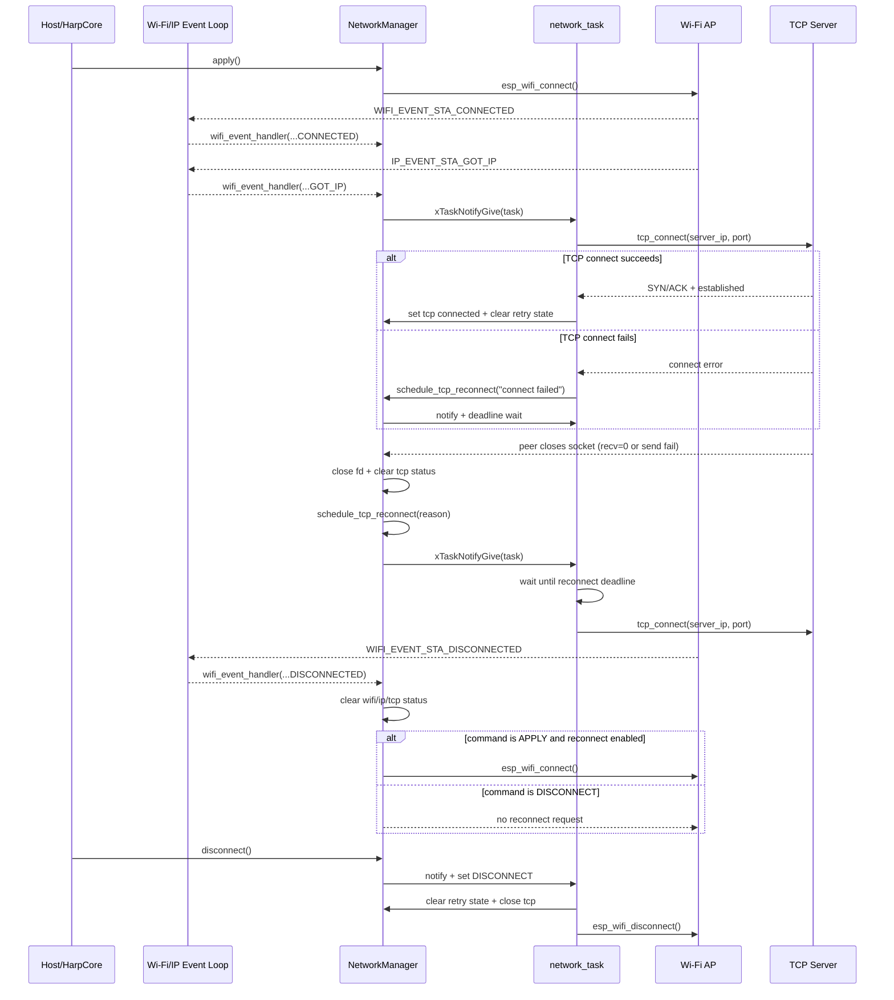

# NetworkManager Operational Notes

This document complements the step-by-step explanation of the network task with practical runtime behavior and maintenance notes.

## 1. What NetworkManager Owns

NetworkManager is responsible for:

1. Wi-Fi station lifecycle (connect, disconnect, reconnect requests).
2. TCP client lifecycle to the configured server endpoint.
3. Network status propagation via R_NET_CONFIG status bits.
4. Retry scheduling and backoff for TCP reconnection.

## 2. High-Level Runtime Flow

1. init sets up NVS, netif, event loop, Wi-Fi STA, and starts the network task.
2. apply snapshots register config into internal state and starts Wi-Fi association.
3. Wi-Fi/IP events update connectivity flags and wake the network task.
4. network task attempts TCP connect when conditions are valid.
5. read/write socket failures trigger reconnect scheduling (when allowed).

## 3. Command and Control Model

The worker task responds to an internal command state:

1. DISCONNECT: close TCP, clear retry state, disconnect Wi-Fi, no auto-reconnect.
2. APPLY: allow Wi-Fi reconnect and TCP connect/reconnect behavior.

Manual disconnect always wins over any pending reconnect timer.

## 4. Event-Driven Triggers

Primary triggers that wake or influence the task:

1. IP_EVENT_STA_GOT_IP:
- Marks Wi-Fi connected.
- Sets IP status bit.
- Notifies the network task to attempt TCP connection.

2. WIFI_EVENT_STA_DISCONNECTED:
- Marks Wi-Fi and TCP disconnected.
- Closes socket.
- Clears Wi-Fi/IP/TCP status bits.
- If command is APPLY and reconnect is enabled, requests Wi-Fi reconnect.

3. TCP read/write failure paths:
- Close socket and clear TCP status bit.
- Schedule delayed reconnect using backoff policy.
- Notify network task.

## 5. Reconnect Policy (Current)

Policy characteristics:

1. Base delay: 500 ms.
2. Exponential growth per attempt.
3. Max delay cap: 8000 ms.
4. Reconnect scheduling requires:
- reconnect enabled,
- TCP enabled in config,
- Wi-Fi connected,
- command not DISCONNECT.

On successful TCP connect, retry state is reset.

## 6. Wait Strategy in network_task

Each loop computes wait_ticks as:

1. Infinite wait by default (event-driven sleep).
2. Finite timeout when reconnect is pending.
3. Immediate wake (0 ticks) when reconnect deadline already passed.

The task then blocks on ulTaskNotifyTake until:

1. A notification arrives, or
2. The scheduled reconnect timeout expires.

This allows low CPU usage while still supporting timer-based retries.

## 7. Status Bits and Meaning

R_NET_CONFIG status bits [5:2]:

1. cfg_valid (bit 2): config snapshot accepted for apply path.
2. wifi_up (bit 3): STA associated with AP.
3. ip_ok (bit 4): IP obtained.
4. tcp_conn (bit 5): TCP socket currently connected.

Operational notes:

1. tcp_conn reflects socket state and clears on peer close/read/write errors.
2. wifi_up/ip_ok clear when Wi-Fi disconnect event is received.

## 8. Safety and Concurrency Notes

1. Atomic flags are used for frequently-read connection state.
2. Socket fd is atomically exchanged before close to avoid duplicate close races.
3. Config is copied into a local snapshot before connect operations.
4. Reconnect scheduling is centralized to keep behavior consistent.

## 9. Important Current Limits

1. Config persistence currently stores one network profile (single slot).
2. Backoff has no jitter yet.
3. No dedicated diagnostic counters exposed to host beyond status bits.

Persistence behavior (current):

1. apply saves SSID, password, server IP, port, and enable bits to NVS.
2. init restores persisted config and auto-applies it when Wi-Fi enable is set.
3. disconnect erases the persisted config key to match clear/disconnect semantics.

## 10. Quick Troubleshooting Guide

If TCP does not reconnect:

1. Verify Wi-Fi is connected and IP is present.
2. Verify TCP enable bit is set in config.
3. Verify command state is APPLY (not manual DISCONNECT path).
4. Confirm server endpoint (IP/port) is reachable.
5. Inspect logs for reconnect scheduling and connect failures.

If reconnect loops too quickly:

1. Confirm delay cap and attempt progression are applied.
2. Check for repeated immediate external notifications forcing frequent loop wakeups.
3. Consider adding jitter in a future update.

## 11. Suggested Next Enhancements

1. Persistence of network config to NVS with boot-time restore.
2. Structured logging fields for reason and attempt number.
3. Optional jitter for multi-device deployments.
4. Host-visible reconnect counters/last-error reason register.
5. Test matrix for server-close, AP-flap, and endpoint-unreachable scenarios.

## 12. Sequence Diagram

